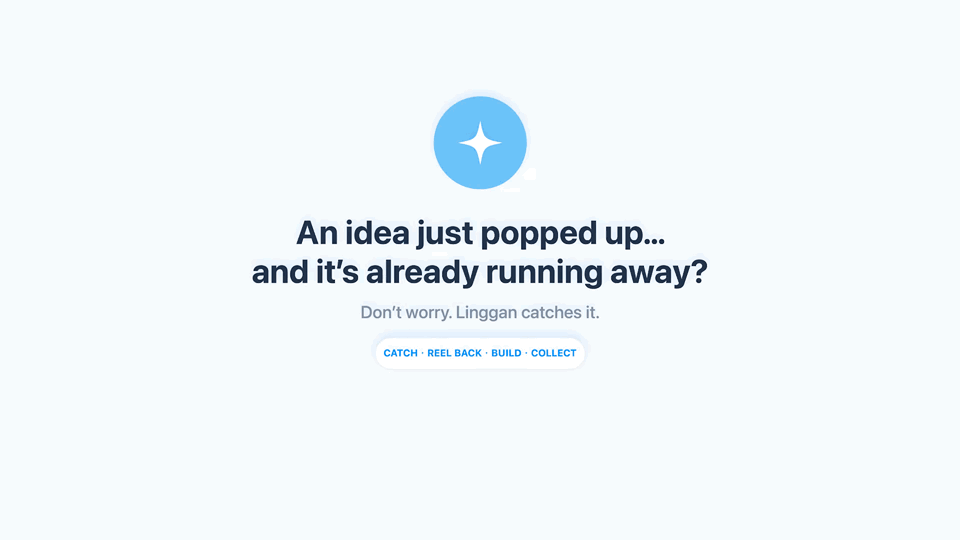
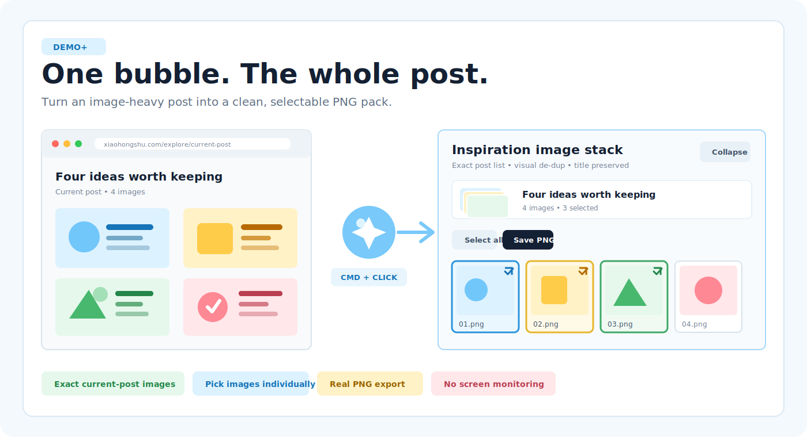
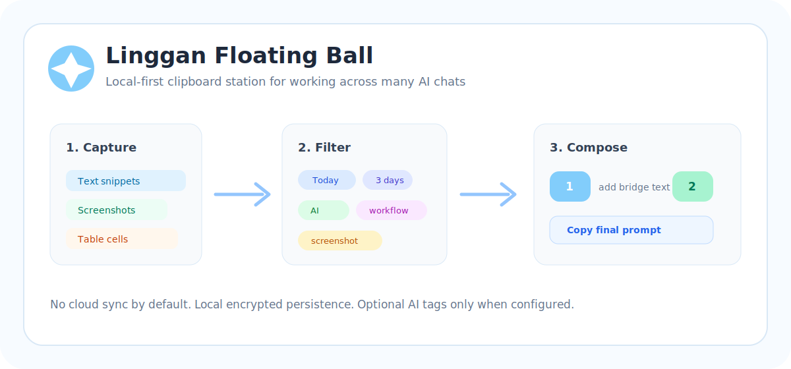

# Linggan Floating Ball

> Catch scattered ideas before your fish-memory forgets them.

[](https://github.com/IvyCHEN03/clipboard-station/actions/workflows/ci.yml)
[](https://github.com/IvyCHEN03/clipboard-station/actions/workflows/release.yml)


[](LICENSE)

**An idea just popped up, and it is already running away. Linggan catches it.**

Linggan Floating Ball is a local-first macOS companion for collecting useful text, screenshots, table snippets, and every image from a post while you move across AI chats, browsers, notes, and spreadsheets.

[Watch the 26-second demo](https://raw.githubusercontent.com/IvyCHEN03/clipboard-station/main/docs/assets/social/linggan-x-teaser-en-1080p.mp4) · [观看中文版](https://raw.githubusercontent.com/IvyCHEN03/clipboard-station/main/docs/assets/social/linggan-x-teaser-cn-1080p.mp4) · [Quick Start](#quick-start) · [Privacy](PRIVACY.md)

[](https://raw.githubusercontent.com/IvyCHEN03/clipboard-station/main/docs/assets/social/linggan-x-teaser-en-1080p.mp4)

Copy fragments as they appear, find them again with tags and search, arrange them into one reusable prompt, or `Cmd` + click the bubble to turn an image-heavy post into a selectable PNG stack.

Everything stays local by default. Optional AI tagging runs only after you configure it. If Linggan catches a spark for you, a GitHub star helps shape what comes next.

## 10-Second Pitch

**One bubble. Two superpowers.**

| Collect ideas | Collect images |
| --- | --- |
| Keep repeated text, screenshots, and table cells visible, searchable, and reorderable. | Capture the current multi-image post, select the keepers, and export real PNG files. |

Everything stays local by default. Optional AI tagging only runs after you configure it.

## Demo+: Capture A Whole Post

**Stop right-clicking twenty images one by one.** `Cmd` + click the Linggan bubble to collect the current post as one temporary image row. Double-click the row, pick individual images, and save a clean PNG pack.



- Reads the current post's own image list on supported sites instead of scraping unrelated page images.
- Preserves the post title as the temporary-row and export name.
- Retries alternate original-image URLs and filters avatars, stickers, logos, and visual duplicates.
- Requires no continuous screen sharing or screen monitoring.

## Best Fit

Use it if you:

- Compare answers across several AI chats.
- Collect quotes, logs, screenshots, spreadsheet cells, or notes before asking a better question.
- Need repeated copies to stay in order instead of being deduplicated away.
- Want local-first storage instead of cloud clipboard sync.

Skip it if you mainly need cross-device clipboard sync, long-term note taking, or a full clipboard-history replacement.

## 2-Minute Trial

1. Copy useful fragments from AI chats, web pages, notes, screenshots, or spreadsheets.
2. Click the small blue floating bubble to keep everything visible.
3. Filter by search, tag, type, or recent time window.
4. Drag snippets into the bottom composer and type text between the blocks.
5. Copy the final composed prompt back into any AI input box.

## Quick Start

For a first trial from source:

```bash
git clone https://github.com/IvyCHEN03/clipboard-station.git
cd clipboard-station
./Scripts/install-local.sh
```

Then click the small blue floating bubble, copy a few text fragments, and drag them into the composer at the bottom of the station.

For a guided five-minute walkthrough, read [Getting Started](docs/GETTING_STARTED.md). For non-developer install details, read [Install Guide](docs/INSTALL.md).

## Current Status

The app is usable today, but still pre-1.0:

- Local-first by default; no telemetry and no cloud sync.
- AI tagging is optional and only runs after you add your own OpenAI-compatible API settings.
- Local builds are currently unsigned and not notarized, so macOS may require manual approval.
- The floating bubble is the recommended entry point because global shortcuts can conflict with other apps.

## Project Map

| Need | Start here |
| --- | --- |
| Try the app quickly | [Getting Started](docs/GETTING_STARTED.md) |
| Install, repair, or uninstall | [Install Guide](docs/INSTALL.md) |
| Learn the full workflow | [User Guide](docs/USER_GUIDE.md) |
| Collect many web images | [Browser Image Collector](browser-extension/image-collector/README.md) |
| Understand privacy and AI tagging | [Privacy](PRIVACY.md) and [FAQ](docs/FAQ.md) |
| Compare product positioning | [Product Positioning](docs/POSITIONING.md) |
| Contribute a small fix | [Contributing](CONTRIBUTING.md), [Development Guide](docs/DEVELOPMENT.md), and [Good First Issues](docs/GOOD_FIRST_ISSUES.md) |
| Understand community expectations | [Code of Conduct](CODE_OF_CONDUCT.md) |
| Prepare a release | [Release Checklist](docs/RELEASE_CHECKLIST.md) |
| Push and publish safely | [Publishing Guide](docs/PUBLISHING.md) |
| Configure repository labels | [GitHub Labels](docs/LABELS.md) |
| Configure the GitHub profile | [Repository Profile](docs/REPOSITORY_PROFILE.md) |
| Plan a public launch | [Open Source Growth Plan](docs/OPEN_SOURCE_GROWTH.md) |

## Demo: Build A Better Prompt

The privacy-safe product previews show both core loops without exposing private clipboard or browser content: collect fragments into a final prompt, or collect a whole image post into a selectable PNG stack.

### 26-Second Motion Demo

[](https://raw.githubusercontent.com/IvyCHEN03/clipboard-station/main/docs/assets/social/linggan-x-teaser-en-1080p.mp4)

Watch the cursor collect and drag a snippet into the block composer, copy the result, then `Cmd`-click the floating bubble to select post images and save a clean PNG pack. The synthetic demo contains no private clipboard content, accounts, or API keys.

[English HD](https://raw.githubusercontent.com/IvyCHEN03/clipboard-station/main/docs/assets/social/linggan-x-teaser-en-1080p.mp4) · [中文高清版](https://raw.githubusercontent.com/IvyCHEN03/clipboard-station/main/docs/assets/social/linggan-x-teaser-cn-1080p.mp4)

See [docs/DEMO.md](docs/DEMO.md) for the recording script, screenshot checklist, privacy rules, and release-note copy.



## Why It Exists

When you are comparing ideas across multiple AI tools, the default clipboard is too small:

- `Cmd+C` overwrites the last useful thing you copied.
- Screenshots and table snippets get lost in Finder or Downloads.
- You need to combine scattered fragments into one prompt, but the order keeps changing.
- Cloud clipboard tools feel risky when the content is private.

Linggan Floating Ball keeps that work local and gives it a small, always-available place to land.

## Why Trust It

- The core workflow runs locally on your Mac.
- Snippets are encrypted at rest with a Keychain-backed key.
- Diagnostics avoid clipboard contents, API keys, and encrypted state.
- The full project check runs build, tests, script checks, Markdown links, plist lint, and version metadata.
- Releases include checksum verification, and unsigned-build limitations are documented before install.

## Highlights

- Local macOS menu bar utility with a small blue floating bubble.
- Collect plain text from normal copy events.
- Import screenshots and show them directly in the list.
- Capture spreadsheet-like copied text as table snippets.
- Search by title, source, body, tag, or time window.
- Use AI-generated titles and tags with any OpenAI-compatible chat completions API.
- Select multiple snippets and delete them in one action.
- Select snippets inside the current filtered view and paste them in the exact visible order.
- Use `Rewind` to reverse only the current filtered results; double-click to restore the normal order.
- Run batch tagging and deletion only against the active filtered scope, never hidden snippets.
- Reorder snippets with up/down buttons or a numeric position field.
- Compose a prompt in the bottom block editor with colored snippet blocks and custom text between blocks.
- Clear the block composer in one click without deleting the original snippets.
- Copy or paste a snippet into the current input box.
- Export the current filtered list as readable Markdown.
- Export and import local JSON backups for snippets, settings, and attachments.
- Clear local snippets, composer text, and attachment files from Settings.
- Use `Cmd` + click on the floating bubble to capture the current image-heavy post as a titled stack.
- Expand a post stack, select images individually, de-duplicate them visually, and save real PNG files.
- Store data locally with Keychain-backed AES-GCM encryption.
- No cloud sync and no uploads unless you explicitly enable AI tagging.

## Product Shape

The app has three surfaces:

- Floating bubble: the fastest way to open or hide the station without fighting global shortcuts.
- Menu bar icon: a stable fallback entry point.
- Station window: searchable snippet list, AI tags, sorting controls, and the composition box.

Global shortcuts are intentionally secondary. Some apps, including developer tools, reserve common shortcuts. The floating bubble is the recommended daily entry point.

## Install

This project is currently source-first. A signed release is on the roadmap.

If a GitHub Release is available, download `Linggan-Floating-Ball-<version>.zip`, verify the matching `.sha256` file, unzip it, and open `ClipboardStation.app`. Release builds are currently unsigned and may require approval in macOS Privacy & Security.

For non-developer setup, checksum verification, permissions, and uninstall steps, read [Install Guide](docs/INSTALL.md).

Requirements:

- macOS 13+
- Xcode command line tools
- Swift 6 compatible toolchain

Clone the project:

```bash
git clone https://github.com/IvyCHEN03/clipboard-station.git
cd clipboard-station
```

Install a local app into `~/Applications` and start the launch agent:

```bash
./Scripts/install-local.sh
```

The floating bubble should appear after installation. The app will also start on login through a user LaunchAgent.

Developers can read [Architecture](docs/ARCHITECTURE.md) for the capture pipeline, data model, persistence flow, and testing map.

## Browser Image Collector

The repo includes a Chrome/Edge companion extension for posts with many images and no convenient "download selected" flow.

It gathers the current post into a titled temporary row, expands that row on double-click, and saves individually selected images as PNG through the browser download manager. On supported post pages such as Xiaohongshu, it reads the post's structured image list, retries alternate source URLs, and removes URL-level and visual duplicates. When the extension is installed, `Cmd` + clicking the native Linggan floating bubble starts capture; clicking the bubble again can collapse the open image panel.

To try it locally, load [browser-extension/image-collector](browser-extension/image-collector/README.md) as an unpacked extension from `chrome://extensions`.

The extension does not bypass paywalls, authentication, DRM, or platform permissions. Generic article pages use a scoped DOM fallback, while supported post pages use their structured post image list.

For development, run directly from source:

```bash
swift run
```

Package a local `.app`:

```bash
./Scripts/package-app.sh
open .build/ClipboardStation.app
```

Create a local release zip:

```bash
./Scripts/make-release-notes.sh v0.4.0
./Scripts/make-release-zip.sh
./Scripts/verify-release.sh .build/dist/Linggan-Floating-Ball-v0.4.0.zip
```

Release notes should follow [Release Notes Template](docs/RELEASE_NOTES_TEMPLATE.md) so users see install limits, checksum steps, privacy notes, and known issues before downloading.

The packaged app is not notarized yet. macOS may ask you to approve opening it from Privacy & Security.

Uninstall the local app and launch agent:

```bash
./Scripts/uninstall-local.sh
```

Run a local health check:

```bash
./Scripts/doctor.sh
```

## Permissions

The app can work without full permissions, but these unlock the smooth workflow:

- Accessibility: required for automatic paste and simulated copy/paste actions.
- Screen capture flow: screenshots are collected only when you copy/import them.
- Launch at login: optional; keeps the floating bubble available after restart.

The app shows permission status in Settings so users can tell whether a feature is unavailable because of macOS permissions or because the app is not running.

## Troubleshooting

- Floating bubble missing: run `./Scripts/doctor.sh`, then `./Scripts/install-local.sh`.
- Automatic paste fails: grant Accessibility permission to ClipboardStation in macOS Settings.
- AI tags fail: check Base URL, model name, API key, and provider quota.
- Duplicate app instances: run `./Scripts/uninstall-local.sh`, then `./Scripts/install-local.sh`.

## AI Tagging

AI tagging is off by default.

To enable it, open Settings and fill:

- AI Base URL: an OpenAI-compatible `/chat/completions` endpoint.
- Model name: for example `gpt-4o-mini` or a compatible model from your provider.
- API Key: saved in macOS Keychain.

Only snippets that need tags are sent. Existing tags are preserved. Failed tagging attempts are marked per snippet and can be retried.

## Privacy

Linggan Floating Ball is local-first:

- Snippets are saved under `~/Library/Application Support/ClipboardStation/state.enc`.
- The encryption key is stored in macOS Keychain.
- Clipboard content is not uploaded by default.
- AI providers receive snippet text only if you enable AI tagging and configure an API key.

Read [PRIVACY.md](PRIVACY.md) for the full data flow.

## Roadmap

The next product priorities are:

- Signed and notarized releases.
- A real screenshot or short demo GIF.
- More persistence and pasteboard-import edge-case tests.
- Better keyboard-first navigation in the snippet list and block composer.
- Better OCR controls for screenshots.
- Optional release builds with Sparkle or a simple updater.

See [ROADMAP.md](ROADMAP.md) for more detail.

## Contributing

The project is early but usable. Good first contributions:

- Fix macOS permission edge cases.
- Add tests for persistence, AI parsing, and snippet import behavior.
- Improve accessibility labels and keyboard navigation.
- Add screenshots or a demo GIF.
- Improve install and troubleshooting docs for non-developers.

Read [CONTRIBUTING.md](CONTRIBUTING.md), [Good First Issues](docs/GOOD_FIRST_ISSUES.md), and [Code of Conduct](CODE_OF_CONDUCT.md) before opening a PR.

For local development commands, code map, privacy rules, and testing expectations, read [Development Guide](docs/DEVELOPMENT.md).

Quality gates:

```bash
./Scripts/check-project.sh
```

CI runs the same project checks on GitHub Actions, including build, tests, shell syntax, script permissions, safe script dry-runs, local Markdown links, bundle plist, and version metadata. Tagged releases matching `v*` build a zip artifact automatically.

Maintainers can cut a prerelease with:

```bash
./Scripts/publish-prerelease.sh --apply v0.4.0
```

The release workflow uses [VERSION](VERSION) for local zips and the Git tag for GitHub release zips.

For a public repository launch, use [GitHub Launch Checklist](docs/LAUNCH_CHECKLIST.md).

For safe push, token, tag, and prerelease steps, use [Publishing Guide](docs/PUBLISHING.md).

## License

MIT. See [LICENSE](LICENSE).
